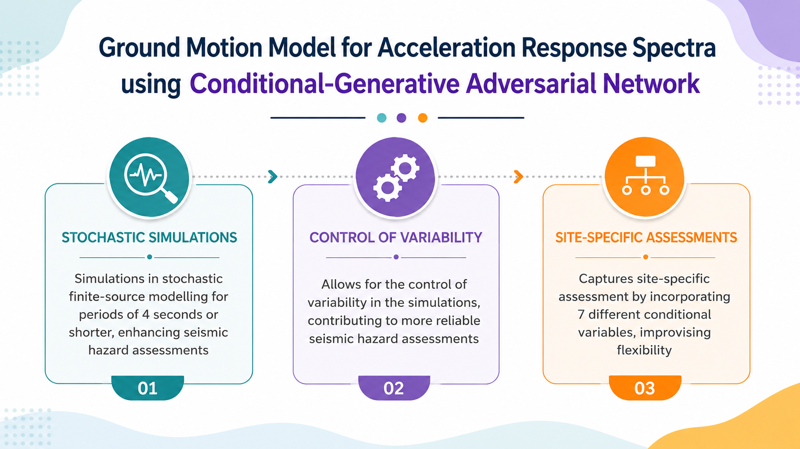
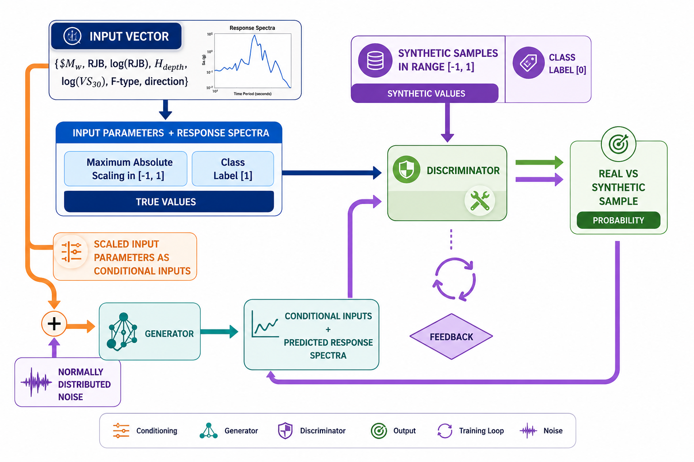
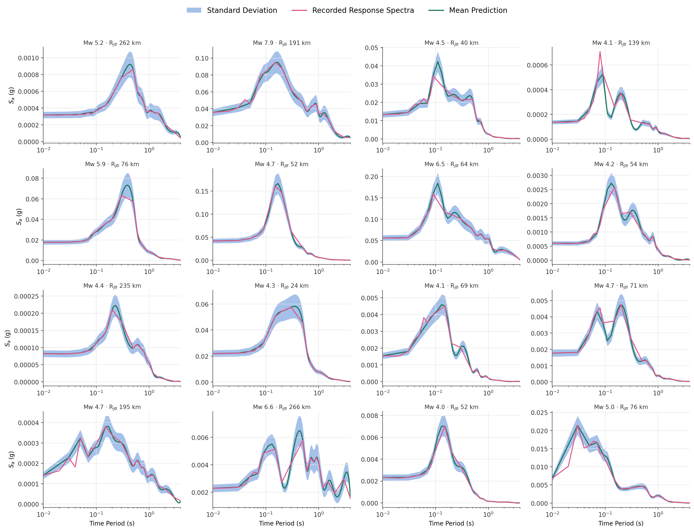

# Ground Motion Model for Acceleration Response Spectra using Conditional Generative Adversarial Network (CGAN)

<p align="center">

[]()
[]()
[]()

</p>

---

## Overview

This repository presents a **Conditional Generative Adversarial Network (CGAN)** framework for predicting **earthquake acceleration response spectra** using earthquake source and site-specific parameters.

Traditional stochastic finite-source simulations are computationally expensive for generating large numbers of response spectra. The proposed CGAN learns the underlying statistical distribution of recorded ground motions and efficiently generates realistic response spectra conditioned on earthquake characteristics.

The framework provides a fast and flexible surrogate model suitable for seismic hazard assessment, structural engineering applications, and uncertainty quantification.

---

# Project Overview

<p align="center">

</p>

### Key Features

- Predicts earthquake acceleration response spectra using Conditional GANs
- Incorporates seven earthquake and site-specific conditional variables
- Generates stochastic response spectra through adversarial learning
- Produces uncertainty estimates using Monte Carlo sampling
- Suitable for probabilistic seismic hazard assessment

---

# Conditional GAN Architecture

<p align="center">

</p>

The proposed model consists of two competing neural networks:

## Generator

The Generator receives

- Random Gaussian noise
- Conditional earthquake parameters

and produces synthetic acceleration response spectra.

Its objective is to generate spectra that closely resemble recorded observations.

---

## Discriminator

The Discriminator receives

- Recorded response spectra
- Generated response spectra
- Corresponding conditional variables

and predicts whether the input spectrum is **real** or **synthetic**.

The generator and discriminator are trained simultaneously through an adversarial minimax optimization process until the generated spectra become statistically indistinguishable from recorded data.

---

# Conditional Input Variables

The model conditions the generated response spectra using the following parameters.

| Variable | Description |
|-----------|-------------|
| Mw | Moment Magnitude |
| RJB | Joyner-Boore Distance |
| log(RJB) | Logarithmic Joyner-Boore Distance |
| Hdepth | Hypocentral Depth |
| log(VS30) | Site Shear Wave Velocity |
| Fault Type | Earthquake Fault Mechanism |
| Direction | Ground Motion Component |

---

# Repository Structure

```
CGAN-Response-Spectra
│
├── complete_model.py
├── CGAN_under_deployment.py
├── plot_response_spectra_grid.py
├── final_data.csv
├── requirements.txt
├── README.md
│
└── images
    ├── project_overview.png
    ├── cgan_workflow.png
    └── response_spectra_grid.png
```

---

# Installation

Clone the repository

```bash
git clone https://github.com/pavanmanam846/cgan-response-spectra.git

cd cgan-response-spectra
```

Install the required dependencies

```bash
pip install -r requirements.txt
```

---

# Required Libraries

The project requires the following Python packages.

```python
import numpy as np
import pandas as pd
import matplotlib.pyplot as plt
import seaborn as sns

from scipy.stats import gaussian_kde
from scipy.stats import kurtosis
from scipy.stats import skew

from sklearn.metrics import r2_score

import warnings
warnings.filterwarnings("ignore")

import math
import csv

import torch
import torch.nn as nn
import torch.optim as optim

from torch import autograd
from torch.autograd import Variable
from torch.utils.data import Dataset, DataLoader
from torchvision.utils import make_grid
```

---

# Model Training

Run

```bash
python complete_model.py
```

This script

- Loads and preprocesses the dataset
- Applies maximum absolute scaling
- Builds the Generator and Discriminator
- Trains the Conditional GAN
- Saves the trained model weights
- Plots Generator and Discriminator losses

For improved training stability, GPU acceleration is recommended.

---

# Model Deployment

After training,

```bash
python CGAN_under_deployment.py
```

The deployment script

- Loads the trained Generator
- Generates response spectra conditioned on user inputs
- Produces multiple stochastic realizations
- Computes the mean prediction and uncertainty band
- Compares predictions with recorded spectra

---

# Model Validation

```bash
python plot_response_spectra_grid.py
```

This script generates comparison plots between recorded response spectra and CGAN predictions.

<p align="center">

</p>

The figure illustrates

- Recorded Response Spectra
- Mean CGAN Prediction
- Prediction Standard Deviation

for representative earthquake records.

The close agreement demonstrates that the proposed CGAN successfully captures both the amplitude and variability of recorded ground motions.

---

# Applications

The developed framework can be applied to

- Ground Motion Simulation
- Earthquake Engineering
- Performance-Based Design
- Probabilistic Seismic Hazard Assessment (PSHA)
- Structural Reliability Analysis
- Seismic Risk Assessment

---

# Future Improvements

Future developments may include

- Physics-informed CGANs
- Multi-component ground motion prediction
- Transfer learning for regional datasets
- Bayesian uncertainty estimation
- Real-time response spectrum generation

---

# Citation

If you use this repository in your research, please cite the associated publication.

```text
Pavan Kumar Manam,
Ground Motion Model for Acceleration Response Spectra using
Conditional Generative Adversarial Network.
```

---

# Author

**Pavan Kumar Manam**


📧 manamkeerthipavankumar@gmail.com

---

# License

This repository is intended for academic and research purposes.
